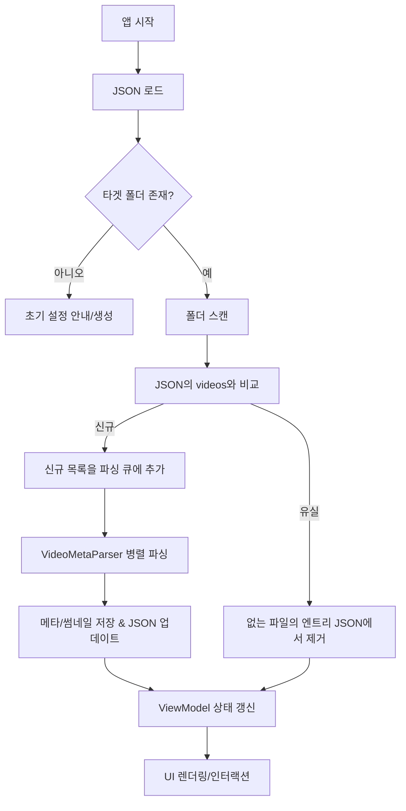

# Airi – 동영상 관리 프로그램 사양서 (v0.1)

> **플랫폼**: Windows (x64), .NET 9, WPF

---

## 1. 개요

Airi는 로컬 폴더의 동영상 파일을 인덱싱하고, 웹에서 메타데이터(제목/날짜/배우/썸네일)를 파싱하여 그리드 썸네일로 탐색·검색·정렬·랜덤 재생을 지원하는 Windows WPF 애플리케이션입니다. 앱 상태는 JSON 파일로 관리합니다.

---

## 2. 핵심 요구사항 요약

* **검색/정렬/랜덤 재생**: 상단 바에 검색어 입력, 제목순/날짜순 정렬 버튼, 랜덤 재생 버튼.
* **배우 리스트**: 좌측 스크롤링 가능한 배우명 리스트(필터 역할).
* **동영상 그리드**: 우측 메인 영역의 썸네일 그리드(가변 셀, 가로 폭에 따라 자동 래핑, 스크롤 가능).
* **더블클릭 재생**: 썸네일 더블클릭 시 Windows 기본 플레이어로 파일 열기.
* **JSON 스토리지**: 타겟 폴더, 동영상 경로 목록, 각 항목의 메타데이터(제목/날짜/배우/썸네일 경로/원본 URL 등) 저장.
* **앱 초기 동작**: 타겟 폴더 스캔 → JSON과 비교 → 신규/삭제 감지 → 신규는 파싱 큐로 → `VideoMetaParser`로 파싱 → JSON 업데이트 → UI 리프레시.

---

## 3. 시스템 아키텍처

```
[File System] ⇄ [Scanner] → [Parse Queue] → [VideoMetaParser] → [JSON Store]
                                  ↓                                 ↑
                             [Thumbnailer]                          │
                                  ↓                                 │
                               [Cache]        ←──────── [ViewModel] ┘
                                  ↓
                                [UI]
```

* **Scanner**: 타겟 폴더 재귀 스캔, 지원 확장자 필터, JSON과의 diff 산출(신규/유실/변경 시간차).
* **VideoMetaParser**: 웹 파싱(제목/날짜/배우/썸네일 URL) + 썸네일 다운로드/캐시.
* **JSON Store**: 단일 `videos.json`(또는 샤딩 옵션)로 앱 상태 영속화.
* **ViewModel**: MVVM 패턴. 필터/정렬/검색 상태를 바인딩.
* **UI**: WPF + Virtualizing 패널로 대용량 그리드 성능 확보.

---

## 4. 데이터 모델 및 JSON 스키마

### 4.1 JSON 파일 구조

* 경로: `%AppData%/Airi/videos.json` (기본값, 설정으로 변경 가능)
* 문자셋: UTF-8 (BOM 없음)

```jsonc
{
  "version": 1,
  "targets": [
    {
      "root": "./Videos",      // 스캔할 루트 폴더
      "includePatterns": ["*.mp4", "*.mkv", "*.avi"],
      "excludePatterns": [""],
      "lastScanUtc": "2025-09-20T12:00:00Z"
    }
  ],
  "videos": [
    {
      "path": "./Videos/sample.mp4",
      "meta": {
        "title": "Sample Title",
        "date": "2024-05-10",                 // ISO-8601 yyyy-MM-dd
        "actors": ["Actor A", "Actor B"],
        "thumbnail": "./Videos/Thumbnails/1f3d1c3e.jpg", // 비디오 제목과 동일한 제목으로 저장
        "tags": ["tag1", "tag2"]
      }
    }
  ]
}
```

### 4.2 엔터티(내부 모델)

```csharp
public record TargetFolder(
    string Root,
    IReadOnlyList<string> IncludePatterns,
    IReadOnlyList<string> ExcludePatterns,
    DateTime? LastScanUtc);

public record VideoItem(
    string Path,
    VideoMeta Meta
);

public record VideoMeta(
    string Title,
    DateOnly? Date,
    IReadOnlyList<string> Actors,
    string Thumbnail,
    IReadOnlyList<string> Tags
);
```

---

## 5. UI/UX 상세

### 5.1 레이아웃

**UI 참조**: `concept.png`

* **상단 바**

  * 검색 입력(TextBox, 즉시 필터링, Enter로 고정 검색)
  * 정렬 버튼 2종(제목순/날짜순; 토글/라디오)
  * 랜덤 재생 버튼(현재 필터 결과에서 무작위 1개 선택 후 재생)
* **좌측 패널(배우 리스트)**

  * VirtualizingStackPanel + Incremental Loading
  * 배우 선택 시 우측 그리드가 해당 배우 필터로 갱신
  * 배우 다중 선택(Shift/Ctrl) 옵션 **(확장)**
* **우측 메인 그리드(썸네일)**

  * `ItemsControl` + `WrapPanel` 또는 `VirtualizingWrapPanel`
  * 셀: 썸네일 이미지, 제목(단일/두 줄 ellipsis), 날짜(옵션)
  * 더블클릭 시 `Process.Start("explorer.exe", videoPath)`를 통한 기본 플레이어 호출
* **상태 바**(하단, 선택 사항)

  * 총 개수, 필터 결과 개수, 스캔/파싱 진행 상태 표시

### 5.2 상호작용 규칙

* 검색은 제목/배우를 대상으로 OR 매칭(기본), 고급 검색 쿼리 **(확장)**
* 정렬은 안정 정렬; 동일 키 시 보조키 `title`
* 썸네일 지연 로딩 및 캐싱. 스크롤 진입 시 디코딩.

---

## 6. 앱 실행 플로우



### 6.1 의사코드

```csharp
async Task RunStartupAsync()
{
    var store = await JsonStore.LoadAsync();
    var diffs = await Scanner.ScanAndDiffAsync(store.Targets, store.Videos);

    store.ApplyRemovals(diffs.MissingFiles); // 3
    ParseQueue.Enqueue(diffs.NewFiles);      // 2

    await JsonStore.SaveAsync(store);

    await foreach (var batch in ParseQueue.GetBatchesAsync())
    {
        var results = await VideoMetaParser.ParseAsync(batch); // 4,5
        store.Upsert(results);
        await JsonStore.SaveAsync(store); // 6
        ViewModel.RefreshFrom(store);
    }
}
```

---

## 7. 컴포넌트 설계 (요약)

* **Scanner**

  * `IEnumerable<string> EnumerateVideoFiles(TargetFolder)`
  * 빠른 비교: (경로, 파일 크기, mtime) → 변경 감지, 필요 시 해시(옵션)
* **ParseQueue**

  * `Channel<VideoCandidate>` 기반의 비동기 큐
  * 동시성 제한(예: `MaxDegreeOfParallelism = 4`)
* **VideoMetaParser**

  * 소스별 파서 인터페이스: `IVideoMetaSource { bool CanHandle(file); Task<VideoMeta> ParseAsync(file); }`
  * HTTP 클라이언트 타임아웃/재시도/레이트리밋
  * 썸네일 저장기: `IThumbnailStore.SaveAsync(url, id)`
* **JsonStore**

  * 원자적 쓰기(임시 파일 → 교체), 예외 내구성
  * 백업 롤링(옵션) 및 버전 마이그레이션
* **ViewModel (MVVM)**

  * 상태: `ObservableCollection<VideoVM>`, `SelectedActors`, `SortKey`, `Query`
  * 필터/정렬/검색은 CollectionView로 구성

---

## 8. 외부 연동 및 보안

* **기본 플레이어 호출**: `ProcessStartInfo`로 ShellExecute
* **웹 파싱**: User-Agent 지정, robots 정책 준수, 과도한 트래픽 방지
* **캐시/임시 파일**: `%LocalAppData%/Airi/cache` (썸네일/HTTP 캐시)
* **프라이버시**: 사용자의 로컬 경로/목록은 외부 전송 금지

---

## 9. 성능 및 안정성

* Virtualizing 패널과 지연 로딩으로 1\~5만 건 썸네일까지 원활한 스크롤 목표
* 파싱·썸네일 다운로드는 백그라운드 Task + 동시성 제한
* JSON 파일 크기 증가 시 샤딩(`videos-000.json` 등) 또는 경량 인덱스(`index.bin`) 고려

---

## 10. 에러 처리 & 로깅

* 스캔/파싱/저장 단계별 try-catch, 사용자에게 비차단형 토스트 노출
* 로깅: `Serilog`(rolling file), 수준별(LogLevel) 필터링
* 실패한 파싱 항목 재시도 큐 및 상태 플래그(`parseFailed`, `retryCount`)

---

## 11. 테스트 계획(요약)

* **단위**: Scanner, Diff, Parser(모킹된 HTTP), JsonStore(원자적 저장)
* **통합**: 실제 폴더 샘플 세트로 스캔/파싱 시나리오
* **UI**: 검색/정렬/필터/더블클릭 재생 동작
* **회귀**: 대량 항목(≥ 10k) 스크롤 성능 측정
